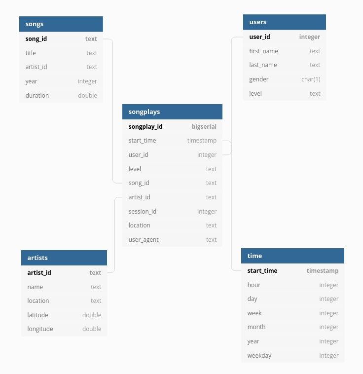

# Data Modeling With PostgreSQL

## Introduction

The background information is taken from the project instructions: 

> A startup called Sparkify wants to analyze the data they've been collecting on songs and user activity on their new music streaming app. The analytics team is particularly interested in understanding what songs users are listening to. Currently, they don't have an easy way to query their data, which resides in a directory of JSON logs on user activity on the app, as well as a directory with JSON metadata on the songs in their app.
> 
> They'd like a data engineer to create a Postgres database with tables designed to optimize queries on song play analysis, and bring you on the project. Your role is to create a database schema and ETL pipeline for this analysis. You'll be able to test your database and ETL pipeline by running queries given to you by the analytics team from Sparkify and compare your results with their expected results.

## Project Description

The project description is taken from the project instructions:

> In this project, you'll apply what you've learned on data modeling with Postgres and build an ETL pipeline using Python. To complete the project, you will need to define a fact and dimension tables for a star schema for a particular analytic focus, and write an ETL pipeline that transfers data from files in two local directories into these tables in PostgreSQL using Python and SQL.

## Prerequisites

This project makes the folowing assumptions:

- Python 3 is available - the Udacity workspace uses Python 3.6.3 and that is the version used for testing.
- The psycopg2 and pandas Python libraries are available.
- A PostgreSQL database is available on localhost - the Udacity workspace uses PostgreSQL 9.5.23 and that is the version used for testing.

## Python Script Execution

From the terminal:

    python ./create_tables.py
    python ./etl.py

In IPython (provides the kernel in Jupyter Notebooks):

    run create_tables.py
    run etl.py

## Database Schema

The Log and Song JSON files were examined (see Song Dataset and Log Dataset). A fact table (`songplays`) and four dimension tables (`artists`, `songs`, `time`, and `users`) were created and arranged into a star schema (as mentioned in the project requirements). This resulted in several benefits (due to denormalization):

- Less complicated queries - the join logic is generally more simple than that required for a highly normalized schema.
- Business reporting logic is simplifed - business reporting logic becomes less complicated compared to highly normalized schemas.
- Read-only query performance - performance is enhanced when compared to highly normalized schemas.
- Fast aggregations - less complicated queries can result in improved performance for aggregation operations.
- Providing OLAP (online analytical processing) cubes with data - most major OLAP systems can use a star schema as a direct source without requiring a cube structure to be built.

There are disadvantages to using a star schema:

- It is not as flexible analytically compared to a normalized schema, since star schemas tend to be focused toward a particular view of the data.
- Data integrity is not well-enforced.  One-off inserts and updates can result in data anomalies.  This issue can be minimized by highly controlled data loading.

However, these issues will not affect the project since it has a particular analytic focus.

## ETL Process

### Song Dataset

The first dataset (a subset of real data from the *Million Song Dataset*) is comprised of one file per song.  Each file is a JSON file and contains metadata about the song and artist. The files are partitioned by the first three letters of each song's track ID. For example, here are filepaths to two files in this dataset:

    song_data/A/B/C/TRABCEI128F424C983.json
    song_data/A/A/B/TRAABJL12903CDCF1A.json

Here is an example of what a single song file, *TRAABJL12903CDCF1A.json*, looks like:

    {
        "num_songs": 1,
        "artist_id": "ARJIE2Y1187B994AB7",
        "artist_latitude": null,
        "artist_longitude": null,
        "artist_location": "",
        "artist_name": "Line Renaud",
        "song_id": "SOUPIRU12A6D4FA1E1",
        "title": "Der Kleine Dompfaff",
        "duration": 152.92036,
        "year": 0
    }

The `songs` and `artists` dimension tables are populated from parsing these files.

### Log Dataset

Log files comprise the second dataset. These are JSON files and are generated by an event simulator based on the songs in the first dataset. Activity logs from a music streaming app based on specific configurations are simulated.

The log files are partitioned by year and month. For example, here are filepaths to two files in this dataset:

    log_data/2018/11/2018-11-12-events.json
    log_data/2018/11/2018-11-13-events.json

Information of which songs users listened to at a specific time are contained in this data.  These files are parsed to provide data for the `songplays` fact table, as well as the `users` and `time` dimension tables.

A lookup based on the `songs.title`, `artists.name` and `songs.duration` columns is used to populate the `songplays.artist_id` and `songplays.song_id` columns.

During the ETL processing testing it was discovered that some logs do not contain `userId` column information and so the empty space is read as an empty string ('').  This caused inserts to the `users` table to fail. This was mitigated by removing all rows that contain a `userId` column value that is an empty string.

During testing it was discovered that files that contained data *without* at least one empty string in the `userId` column triggered an incompatibility between Pandas and NumPy.  Further details of this can be found [here](
https://stackoverflow.com/questions/40659212/futurewarning-elementwise-comparison-failed-returning-scalar-but-in-the-futur).  The string comparision that triggered the bug `(== '')` was replaced with the `isin('')` function.  No further problems were found.

## Description of Files

This project is comprised of several files:

### Directory - data/log_data

This directory contains a collection of JSON files. These files are used to populate the `songplays` fact table, as well as populate the `users` and `time` dimension tables.

### create_tables.py

This Python script recreates the database and tables used to store the data.

### database-schema.png

This is diagram of the database schema. It was created on [Quick DBD](https://www.quickdatabasediagrams.com/), a website designed to draw database diagrams.

### etl.ipynb

A Jupyter Notebook that was used to explore the data and test the ETL process.

### etl.py

This Python script reads in the log and data files, processes those files, then inserts the results into the database.

### README.md

This file.

### sql_queries.py

A Python script that defines all the SQL statements used by this project.

### test.ipynb

A Jupyter Notebook that was used to test that the data was loaded correctly.